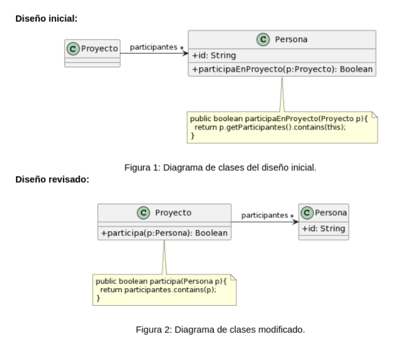

# Ejercicio 1: Algo huele mal
Indique qué malos olores se presentan en los siguientes ejemplos.		

1. 1 Protocolo de Cliente

La clase Cliente tiene el siguiente protocolo. ¿Cómo puede mejorarlo? 

```java

/** 
* Retorna el límite de crédito del cliente
*/
public double lmtCrdt() {...}

/** 
* Retorna el monto facturado al cliente desde la fecha f1 a la fecha f2
*/
protected double mtFcE(LocalDate f1, LocalDate f2) {...}

/** 
* Retorna el monto cobrado al cliente desde la fecha f1 a la fecha f2
*/
private double mtCbE(LocalDate f1, LocalDate f2) {...}
					
```

- Resolucion:   EXTRACT METHOD, RENAME METHOD

```java

public double limiteCredito() {...}

protected double montoFacturadoEntre(LocalDate f1, LocalDate f2) {...}

private double montoCobradoEntre(LocalDate f1, LocalDate f2) {...}
					
```

1. 2 Participación en proyectos 

Al revisar el siguiente diseño inicial (Figura 1), se decidió realizar un cambio para evitar lo que se consideraba un mal olor. El diseño modificado se muestra en la Figura 2. Indique qué tipo de cambio se realizó y si lo considera apropiado. Justifique su respuesta.




- Resolucion: MOVE METHOD, RENAME METHOD

1. 3 Cálculos 

Analice el código que se muestra a continuación. Indique qué code smells encuentra y cómo pueden corregirse.						

```java

public void imprimirValores() {
	int totalEdades = 0;
	double promedioEdades = 0;
	double totalSalarios = 0;
	
	for (Empleado empleado : personal) {
		totalEdades = totalEdades + empleado.getEdad();
		totalSalarios = totalSalarios + empleado.getSalario();
	}
	promedioEdades = totalEdades / personal.size();
		
	String message = String.format("El promedio de las edades es %s y el total de salarios es %s", promedioEdades, totalSalarios);
	
	System.out.println(message);
}

```

- Resolucion:

*Bad Smell*: Long Method

*Refactoring*: Move Method

*Bad Smell*: Reinventa la rueda

*Refactoring*:

*Bad Smell*: 

```java

public void imprimirValores() {
	System.out.println(String.format("El promedio de las edades es %s y el total de salarios es %s", this.promedioEdades(), this.totalSalarios()));
}

public int promedioEdades() {
    return personal.stream().mapToInt(empleado -> empleado.getEdad()).average().orElse(0);
}

public double totalSalarios() {
    return personal.stream().mapToDouble(empleado -> empleado.getSalario()).sum();
}

```