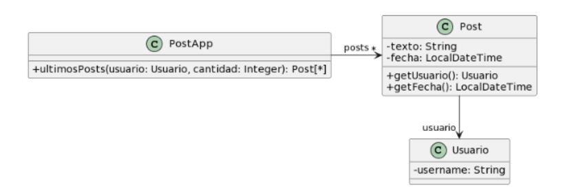
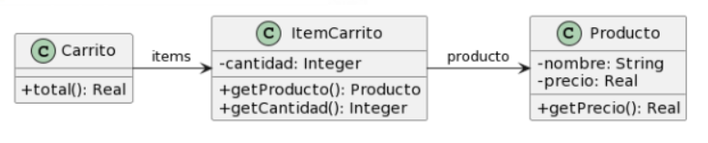
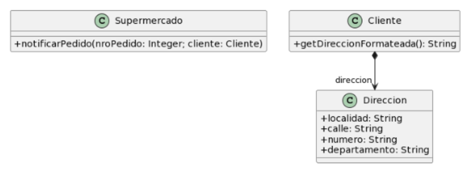
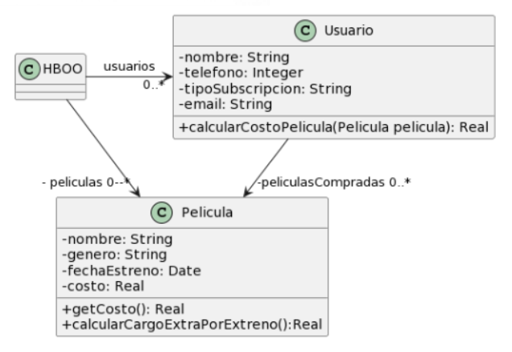

# Ejercicio 2 
Para cada una de las siguientes situaciones, realice en forma iterativa los siguientes pasos:
1. indique el mal olor,
2. indique el refactoring que lo corrige, 
3. aplique el refactoring, mostrando el resultado final (código y/o diseño según corresponda). 
Si vuelve a encontrar un mal olor, retorne al paso (1). 

## 2.1 Empleados

```java

public class EmpleadoTemporario {
    public String nombre;
    public String apellido;
    public double sueldoBasico = 0;
    public double horasTrabajadas = 0;
    public int cantidadHijos = 0;
    // ......
    
public double sueldo() {
    return this.sueldoBasico
        + (this.horasTrabajadas * 500) 
        + (this.cantidadHijos * 1000) 
        - (this.sueldoBasico * 0.13);
}
}

public class EmpleadoPlanta {
    public String nombre;
    public String apellido;
    public double sueldoBasico = 0;
    public int cantidadHijos = 0;
    // ......
    
    public double sueldo() {
        return this.sueldoBasico 
            + (this.cantidadHijos * 2000)
            - (this.sueldoBasico * 0.13);
    }
}

public class EmpleadoPasante {
    public String nombre;
    public String apellido;
    public double sueldoBasico = 0;
    // ......
    
    public double sueldo() {
        return this.sueldoBasico - (this.sueldoBasico * 0.13);
    }
}


```

**CODIGO DUPLICADO -> EXTRACT SUPERCLASS**

```java

public abstract class Empleado {
    public String nombre;
    public String apellido;
    public double sueldoBasico = 0;

    public abstract class sueldo();
}

public class EmpleadoTemporario extends Empleado {
    public double horasTrabajadas = 0;
    public int cantidadHijos = 0;
    // ......
    
    public double sueldo() {
        return this.sueldoBasico
            + (this.horasTrabajadas * 500) 
            + (this.cantidadHijos * 1000) 
            - (this.sueldoBasico * 0.13);
    }
}

public class EmpleadoPlanta extends Empleado {
    public int cantidadHijos = 0;
    // ......
    
    public double sueldo() {
        return this.sueldoBasico 
            + (this.cantidadHijos * 2000)
            - (this.sueldoBasico * 0.13);
    }
}

public class EmpleadoPasante extends Empleado {
    public double sueldo() {
        return this.sueldoBasico - (this.sueldoBasico * 0.13);
    }
}


```

**CODIGO DUPLICADO -> EXTRACT METHOD**

```java

public abstract class Empleado {
    public String nombre;
    public String apellido;
    public double sueldoBasico = 0;

    public double sueldo() {
        return this.sueldoBasico - (this.sueldoBasico * 0.13);
    }
}

public class EmpleadoTemporario extends Empleado implements Aumentos{
    public double horasTrabajadas = 0;
    // ......
    
    public double sueldo() {
        return super.sueldo() + aumentoHorasTabajadas(500) + aumentoCantiHijos(1000);
    }

    public double aumentoHorasTrabajadas(int aumento) {
        return this.horasTrabajadas * aumento
    }

    public double aumentoCantHijos(int aumento) {
        return this.cantHijos * aumento
    }
}

public class EmpleadoPlanta extends Empleado implements Aumentos {
    public int cantidadHijos = 0;
    // ......
    
    public double sueldo() {
        return super.sueldo() + aumentoCantHijos();
    }

    public double aumentoCantHijos(int aumento) {
        return this.cantHijos * aumento
    }
}

public class EmpleadoPasante extends Empleado {
    // ......

    public double sueldo() {
        return super.sueldo();
    }
}


```

## 2.2 Juego 

```java

public class Juego {
    // ......
    public void incrementar(Jugador j) {
        j.puntuacion = j.puntuacion + 100;
    }
    public void decrementar(Jugador j) {
        j.puntuacion = j.puntuacion - 50;
    }
}

public class Jugador {
    public String nombre;
    public String apellido;
    public int puntuacion = 0;
}

```

**FEATURE ENVY -> MOVE METHOD**

```java

public class Juego {
    // ......
    public void incrementar(Jugador j) {
        j.incrementar();
    }
    public void decrementar(Jugador j) {
        j.decrementar();t
    }
}

public class Jugador {
    public String nombre;
    public String apellido;
    public int puntuacion = 0;

    public void incrementar() {
        this.puntuacion += 100;
    }

    public void decrementar() {
        this.puntuacion -= 50;
    }
}

```

**DATA CLUMP -> ENCAPSULATE FIELD**

```java

public class Juego {
    // ......
    public void incrementar(Jugador j) {
        j.incrementar();
    }
    public void decrementar(Jugador j) {
        j.decrementar();
    }
}

public class Jugador {
    private String nombre;
    private String apellido;
    private int puntuacion = 0;

    public void incrementar() {
        this.puntuacion += 100;
    }

    public void decrementar() {
        this.puntuacion -= 50;
    }
}

```

## 2.3 Publicaciones



```java
/**
* Retorna los últimos N posts que no pertenecen al usuario user
*/
public List<Post> ultimosPosts(Usuario user, int cantidad) {
        
    List<Post> postsOtrosUsuarios = new ArrayList<Post>();
    for (Post post : this.posts) {
        if (!post.getUsuario().equals(user)) {
            postsOtrosUsuarios.add(post);
        }
    }
        
    // ordena los posts por fecha
    for (int i = 0; i < postsOtrosUsuarios.size(); i++) {
        int masNuevo = i;
        for(int j= i +1; j < postsOtrosUsuarios.size(); j++) {
            if (postsOtrosUsuarios.get(j).getFecha().isAfter(
                postsOtrosUsuarios.get(masNuevo).getFecha())) {
                masNuevo = j;
            }    
        }
        Post unPost = postsOtrosUsuarios.set(i,postsOtrosUsuarios.get(masNuevo));
        postsOtrosUsuarios.set(masNuevo, unPost);    
    }
        
    List<Post> ultimosPosts = new ArrayList<Post>();
    int index = 0;
    Iterator<Post> postIterator = postsOtrosUsuarios.iterator();
    while (postIterator.hasNext() &&  index < cantidad) {
        ultimosPosts.add(postIterator.next());
    }
    return ultimosPosts;
}

```

**LONG METHOD -> EXTRACT METHOD**

```java
/**
* Retorna los últimos N posts que no pertenecen al usuario user
*/
public List<Post> ultimosPosts(Usuario user, int cantidad) {
    List<Post> postsOtrosUsuarios = eliminarPostUsuario(user);
    postOtrosUsuarios = ordenarPosts(postOtrosUsuarios);
    List<Post> ultimosPosts = ultimosPosts(postOtrosUsuarios, cantidad);

    return ultimosPosts;
}

public List<Post> eliminarPostUsuario(Usuario user) {
    List<Post> postsOtrosUsuarios = new ArrayList<Post>();
    for (Post post : this.posts) {
        if (!post.getUsuario().equals(user)) {
            postsOtrosUsuarios.add(post);
        }
    }

    return postOtrosUsuarios;
}

public List<Post> ordenarPosts(ArrayList<Post> postsOtrosUsuarios) {
    for (int i = 0; i < postsOtrosUsuarios.size(); i++) {
        int masNuevo = i;
        for(int j= i +1; j < postsOtrosUsuarios.size(); j++) {
            if (postsOtrosUsuarios.get(j).getFecha().isAfter(
                postsOtrosUsuarios.get(masNuevo).getFecha())) {
                masNuevo = j;
            }    
        }
        Post unPost = postsOtrosUsuarios.set(i,postsOtrosUsuarios.get(masNuevo));
        postsOtrosUsuarios.set(masNuevo, unPost);    
    }

    return postsOtrosUsuarios;
}

public List<Post> ultimosPosts(ArrayList<Post> postsOtrosUsuarios, int cantidad) {
    List<Post> ultimosPosts = new ArrayList<Post>();
    int index = 0;
    Iterator<Post> postIterator = postsOtrosUsuarios.iterator();
    while (postIterator.hasNext() &&  index < cantidad) {
        ultimosPosts.add(postIterator.next());
        index++;
    }

    return ultimosPosts;
}

```
**REINVENTA LA RUEDA -> REPLACE LOOP WITH PIPELINE**

```java
/**
* Retorna los últimos N posts que no pertenecen al usuario user
*/
public List<Post> ultimosPosts(Usuario user, int cantidad) {
    List<Post> postsOtrosUsuarios = eliminarPostUsuario(user);
    postOtrosUsuarios = ordenarPosts(postOtrosUsuarios);
    List<Post> ultimosPosts = ultimosPosts(postOtrosUsuarios, cantidad);

    return ultimosPosts;
}

public List<Post> eliminarPostUsuario(Usuario user) {
    List<Post> postsOtrosUsuarios = posts.stream().map(post -> post.map(!post.getUsuario().equals(user))).Collectors.toList();

    return postOtrosUsuarios;
}

public List<Post> ordenarPosts(ArrayList<Post> postsOtrosUsuarios) {
    postOtrosUsuarios = postOtrosUsuarios
        .stream()
        .sorted((p1, p2) -> p1.getFecha().compareTo(p2.getFecha()))
        .CollectorsToList();

    return postsOtrosUsuarios;
}

public List<Post> ultimosPosts(ArrayList<Post> postsOtrosUsuarios, int cantidad) {
    List<Post> ultimosPosts = new ArrayList<Post>(portIterator.stream().limit(cantidad).colect(Colectors.toList()));

    return ultomosPosts;
}

```
**TEMPORARY VARIABLE -> REPLACE TEMP WITH QUERY**

```java
/**
* Retorna los últimos N posts que no pertenecen al usuario user
*/
public List<Post> ultimosPosts(Usuario user, int cantidad) {
    return ultimosPosts(ordenarPosts(eliminarPostUsuario(user)), cantidad);
}

public List<Post> eliminarPostUsuario(Usuario user) {
    return posts
        .stream()
        .map(post -> post.map(!post.getUsuario().equals(user)))
        .collect(Collectors.toList());
}

public List<Post> ordenarPosts(ArrayList<Post> postsOtrosUsuarios) {
    return postOtrosUsuarios
        .stream()
        .sorted((p1, p2) -> p1.getFecha().compareTo(p2.getFecha()))
        .collect(CollectorsToList());
}

public List<Post> ultimosPosts(ArrayList<Post> postsOtrosUsuarios, int cantidad) {
    return postOtrosUsuarios
        .stream()
        .limit(cantidad)
        .colect(Colectors.toList())
}

```

## 2.4 Carrito de Compras



```java

public class Producto {
    private String nombre;
    private double precio;
    
    public double getPrecio() {
        return this.precio;
    }
}

public class ItemCarrito {
    private Producto producto;
    private int cantidad;
        
    public Producto getProducto() {
        return this.producto;
    }
    
    public int getCantidad() {
        return this.cantidad;
    }

}

public class Carrito {
    private List<ItemCarrito> items;
    
    public double total() {
        return this.items.stream()
        .mapToDouble(item -> 
        item.getProducto().getPrecio() * item.getCantidad())
        .sum();
    }
}


```

**LONG METHOD -> EXTRACT METHOD**

```java

public class Producto {
    private String nombre;
    private double precio;
    
    public double getPrecio() {
        return this.precio;
    }
}

public class ItemCarrito {
    private Producto producto;
    private int cantidad;
        
    public Producto getProducto() {
        return this.producto;
    }
    
    public int getCantidad() {
        return this.cantidad;
    }

}

public class Carrito {
    private List<ItemCarrito> items;

    public double subTotal(ItemCarrito item) {
        return item.getProducto().getPrecio() * item.getCantidad();
    }
    
    public double total() {
        return this.items.stream()
        .mapToDouble(item -> this.subTotal(item))
        .sum();
    }
}


```

**FEATURE ENVY -> MOVE METHOD**

```java

public class Producto {
    private String nombre;
    private double precio;
    
    public double getPrecio() {
        return this.precio;
    }
}

public class ItemCarrito {
    private Producto producto;
    private int cantidad;
        
    public Producto getProducto() {
        return this.producto;
    }
    
    public int getCantidad() {
        return this.cantidad;
    }

    public double subTotal() {
        return this.producto.getPrecio() * this.getCantidad();
    }

}

public class Carrito {
    private List<ItemCarrito> items;
    
    public double total() {
        return this.items.stream()
        .mapToDouble(item -> item.subTotal())
        .sum();
    }
}

```

## 2.5 Envio de Pedidos



```java

public class Supermercado {
    public void notificarPedido(long nroPedido, Cliente cliente) {
        String notificacion = MessageFormat
        .format(“Estimado cliente, se le informa que hemos recibido su pedido
        con número {0}, el cual será enviado a la dirección {1}”,
        new Object[] { nroPedido, cliente.getDireccionFormateada() });

        // lo imprimimos en pantalla, podría ser un mail, SMS, etc..
        System.out.println(notificacion);
    }
}

public class Cliente {
    private Direccion direccion;

    public String getDireccionFormateada() {
	    return 
		    this.direccion.getLocalidad() + “, ” +
		    this.direccion.getCalle() + “, ” +
		    this.direccion.getNumero() + “, ” +
		    this.direccion.getDepartamento()
        ;
    }
}

```

**METODO LARGO -> MOVE METHOD**

```java

public class Supermercado {
    public generarMensaje(long nroPedido, Cliente cliente) {
        return MessageFormat.format(“Estimado cliente, se le informa que hemos recibido su pedido con número {0}, el cual será enviado a la dirección {1}”, new Object[] { nroPedido, cliente.getDireccionFormateada() });
    }

    public void notificarPedido(long nroPedido, Cliente cliente) {
        String notificacion = this.generarMensaje(nroPedido, cliente);

        // lo imprimimos en pantalla, podría ser un mail, SMS, etc..
        System.out.println(notificacion);
    }
}

public class Cliente {
    private Direccion direccion;

    public String getDireccionFormateada() {
	    return 
		    this.direccion.getLocalidad() + “, ” +
		    this.direccion.getCalle() + “, ” +
		    this.direccion.getNumero() + “, ” +
		    this.direccion.getDepartamento()
        ;
    }
}

```

**FEATURE ENVY -> MOVE METHOD**

```java

public class Supermercado {
    public String generarMensaje(long nroPedido, Cliente cliente) {
        return MessageFormat.format(“Estimado cliente, se le informa que hemos recibido su pedido con número {0}, el cual será enviado a la dirección {1}”, new Object[] { nroPedido, cliente.direccion.getDireccionFormateada() });
    }

    public void notificarPedido(long nroPedido, Cliente cliente) {
        String notificacion = this.generarMensaje(nroPedido, cliente);

        // lo imprimimos en pantalla, podría ser un mail, SMS, etc..
        System.out.println(notificacion);
    }
}

public class Cliente {
    private Direccion direccion;
}

public class Direccion {
    public String localidad;
    public String calle;
    public String numero;
    public String departamento;

    public String getDireccionFormateada() {
	    return 
		    this.getLocalidad() + “, ” +
		    this.getCalle() + “, ” +
		    this.getNumero() + “, ” +
		    this.getDepartamento()
        ;
    }
}

```

**DATA CLASS -> INLINE CLASS**

```java

public class Supermercado {
    public String generarMensaje(long nroPedido, Direccion direccion) {
        return MessageFormat.format(“Estimado cliente, se le informa que hemos recibido su pedido con número {0}, el cual será enviado a la dirección {1}”, new Object[] { nroPedido, direccion.getDireccionFormateada() });
    }

    public void notificarPedido(long nroPedido, Direccion direccion) {
        String notificacion = this.generarMensaje(nroPedido, direccion);

        // lo imprimimos en pantalla, podría ser un mail, SMS, etc..
        System.out.println(notificacion);
    }
}

public class Direccion {
    public String localidad;
    public String calle;
    public String numero;
    public String departamento;

    public String getDireccionFormateada() {
	    return 
		    this.getLocalidad() + “, ” +
		    this.getCalle() + “, ” +
		    this.getNumero() + “, ” +
		    this.getDepartamento()
        ;
    }
}

```

**TEMPORARY VARIABLE -> REPLACE TEMP WITH QUERY**

```java

public class Supermercado {
    public String generarMensaje(long nroPedido, Direccion direccion) {
        return MessageFormat.format(“Estimado cliente, se le informa que hemos recibido su pedido con número {0}, el cual será enviado a la dirección {1}”, new Object[] { nroPedido, direccion.getDireccionFormateada() });
    }

    public void notificarPedido(long nroPedido, Direccion direccion) {
        // lo imprimimos en pantalla, podría ser un mail, SMS, etc..
        System.out.println(this.generarMensaje(nroPedido, direccion));
    }
}

public class Direccion {
    public String localidad;
    public String calle;
    public String numero;
    public String departamento;

    public String getDireccionFormateada() {
	    return 
		    this.getLocalidad() + “, ” +
		    this.getCalle() + “, ” +
		    this.getNumero() + “, ” +
		    this.getDepartamento()
        ;
    }
}

```

**INAPPROPIATE INTIMACY -> ENCAPSULATE FIELD**

```java

public class Supermercado {
    public String generarMensaje(long nroPedido, Direccion direccion) {
        return MessageFormat.format(“Estimado cliente, se le informa que hemos recibido su pedido con número {0}, el cual será enviado a la dirección {1}”, new Object[] { nroPedido, direccion.getDireccionFormateada() });
    }

    public void notificarPedido(long nroPedido, Direccion direccion) {
        // lo imprimimos en pantalla, podría ser un mail, SMS, etc..
        System.out.println(this.generarMensaje(nroPedido, direccion));
    }
}

public class Direccion {
    private String localidad;
    private String calle;
    private String numero;
    private String departamento;

    public String getDireccionFormateada() {
	    return 
		    this.getLocalidad() + “, ” +
		    this.getCalle() + “, ” +
		    this.getNumero() + “, ” +
		    this.getDepartamento()
        ;
    }
}

```

## 2.5 Peliculas



```java

public class Usuario {
    String tipoSubscripcion;
    // ...

    public void setTipoSubscripcion(String unTipo) {
   	    this.tipoSubscripcion = unTipo;
    }
    
    public double calcularCostoPelicula(Pelicula pelicula) {
   	    double costo = 0;
   	    if (tipoSubscripcion=="Basico") {
   		    costo = pelicula.getCosto() + pelicula.calcularCargoExtraPorEstreno();
   	    }
        else if (tipoSubscripcion== "Familia") {
   		    costo = (pelicula.getCosto() + pelicula.calcularCargoExtraPorEstreno()) * 0.90;
   	    }
   	    else if (tipoSubscripcion=="Plus") {
   		    costo = pelicula.getCosto();
   	    }
   	    else if (tipoSubscripcion=="Premium") {
   	 	    costo = pelicula.getCosto() * 0.75;
   	    }
   	    return costo;
    }
}

public class Pelicula {
    LocalDate fechaEstreno;
    // ...

    public double getCosto() {
   	    return this.costo;
    }
    
    public double calcularCargoExtraPorEstreno(){
	    // Si la Película se estrenó 30 días antes de la fecha actual, retorna un cargo de 0$, caso contrario, retorna un cargo extra de 300$
   	    return (ChronoUnit.DAYS.between(this.fechaEstreno, LocalDate.now()) ) > 30 ? 0 : 300;
    }
}

```

**SENTENCE SWITCH -> REPLACE CONDITIONAL WITH POLYMORPHISM**

```java

public  Usuario {
    private Suscripcion suscripcion;

    public void setTipoSubscripcion(Suscripcion suscripcion) {
   	    this.subscripcion = suscripcion;
    }
}

private abstract Suscripcion{

    public abstract double calcularCostoPelicula(Pelicula pelicula);
} 

public class SuscripcionBasico extends Suscripcion {
    public double calcularCostoPelicula(Pelicula pelicula) {
	    costo = pelicula.getCosto() + pelicula.calcularCargoExtraPorEstreno();
        return costo;
   	}
}

public class SuscripcionFamilia extends Suscripcion {
    public double calcularCostoPelicula(Pelicula pelicula) {
	    costo = (pelicula.getCosto() + pelicula.calcularCargoExtraPorEstreno()) * 0.90;
        return costo;
   	}
}

public class SuscripcionPlus extends Suscripcion {
    public double calcularCostoPelicula(Pelicula pelicula) {
	    costo = pelicula.getCosto();
        return costo;
   	}
}

public class SuscripcionPremium extends Suscripcion {
    public double calcularCostoPelicula(Pelicula pelicula) {
	    costo = pelicula.getCosto() * 0.75;
        return costo;
   	}
}

public class Pelicula {
    LocalDate fechaEstreno;
    // ...

    public double getCosto() {
   	    return this.costo;
    }
    
    public double calcularCargoExtraPorEstreno(){
	    // Si la Película se estrenó 30 días antes de la fecha actual, retorna un cargo de 0$, caso contrario, retorna un cargo extra de 300$
   	    return (ChronoUnit.DAYS.between(this.fechaEstreno, LocalDate.now()) ) > 30 ? 0 : 300;
    }
}

```

**TEMPORARY VARIABLE -> REPLACE TEMP WITH QUERY**

```java

public  Usuario {
    private Suscripcion suscripcion;

    public void setTipoSubscripcion(Suscripcion suscripcion) {
   	    this.subscripcion = suscripcion;
    }
}

public abstract Suscripcion{

    public abstract double calcularCostoPelicula(Pelicula pelicula);
} 

public class SuscripcionBasico extends Suscripcion {
    public double calcularCostoPelicula(Pelicula pelicula) {
        return pelicula.getCosto() + pelicula.calcularCargoExtraPorEstreno();
   	}
}

public class SuscripcionFamilia extends Suscripcion {
    public double calcularCostoPelicula(Pelicula pelicula) {
        return (pelicula.getCosto() + pelicula.calcularCargoExtraPorEstreno()) * 0.90;
   	}
}

public class SuscripcionPlus extends Suscripcion {
    public double calcularCostoPelicula(Pelicula pelicula) {
        return pelicula.getCosto();
   	}
}

public class SuscripcionPremium extends Suscripcion {
    public double calcularCostoPelicula(Pelicula pelicula) {
        return pelicula.getCosto() * 0.75;
   	}
}

public class Pelicula {
    LocalDate fechaEstreno;
    // ...

    public double getCosto() {
   	    return this.costo;
    }
    
    public double calcularCargoExtraPorEstreno(){
	    // Si la Película se estrenó 30 días antes de la fecha actual, retorna un cargo de 0$, caso contrario, retorna un cargo extra de 300$
   	    return (ChronoUnit.DAYS.between(this.fechaEstreno, LocalDate.now()) ) > 30 ? 0 : 300;
    }
}


```