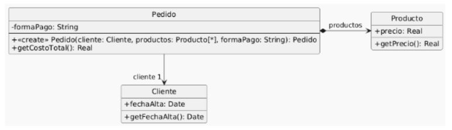

# Ejercicio 4

Se tiene el siguiente modelo de un sistema de pedidos y la correspondiente implementación.



```java 

public class Pedido {
    private Cliente cliente;
    private List<Producto> productos;
    private String formaPago;
    public Pedido(Cliente cliente, List<Producto> productos, String formaPago) {
        if (!"efectivo".equals(formaPago) && !"6 cuotas".equals(formaPago) && !"12 cuotas".equals(formaPago)) {
            throw new Error("Forma de pago incorrecta");
        }
        this.cliente = cliente;
        this.productos = productos;
        this.formaPago = formaPago;
    }
    public double getCostoTotal() {
        double costoProductos = 0;
        for (Producto producto : this.productos) {
            costoProductos += producto.getPrecio();
        }
        double extraFormaPago = 0;
        if ("efectivo".equals(this.formaPago)) {
            extraFormaPago = 0;
        } else if ("6 cuotas".equals(this.formaPago)) {
            extraFormaPago = costoProductos * 0.2;
        } else if ("12 cuotas".equals(this.formaPago)) {
            extraFormaPago = costoProductos * 0.5;
        }
        int añosDesdeFechaAlta = Period.between(this.cliente.getFechaAlta(), LocalDate.now()).getYears();
        // Aplicar descuento del 10% si el cliente tiene más de 5 años de antiguedad
        if (añosDesdeFechaAlta > 5) {
            return (costoProductos + extraFormaPago) * 0.9;
        }
        return costoProductos + extraFormaPago;
    }
}

public class Cliente {
    private LocalDate fechaAlta;
    public LocalDate getFechaAlta() {
        return this.fechaAlta;
    }
}

public class Producto {
    private double precio;
    public double getPrecio() {
        return this.precio;
    }
}

```

### Tareas:

1. Dado el código anterior, aplique únicamente los siguientes refactoring:
- Replace Loop with Pipeline *(líneas 16 a 19)*
- Replace Conditional with Polymorphism *(líneas 21 a 27)*
- Extract method y move method *(línea 28)*
- Extract method y replace temp with query *(líneas 28 a 33)*
2. Realice el diagrama de clases del código refactorizado.

```java 

public class Pedido {
    private Cliente cliente;
    private List<Producto> productos;
    private FormaPago formaPago;
    public Pedido(Cliente cliente, List<Producto> productos, FormaPago formaPago) {
        if (!"efectivo".equals(formaPago) 
                && !"6 cuotas".equals(formaPago) 
                && !"12 cuotas".equals(formaPago)) {
            throw new Error("Forma de pago incorrecta");
        }
        this.cliente = cliente;
        this.productos = productos;
        this.formaPago = formaPago;
    }
    public double getCostoTotal() {
        double costoProductos = productos.stream().mapToDouble(p -> p.getPrecio()).sum();
        double extraFormaPago = formaPago.estraFormaPago(costoProductos)
        return this.aplicarDescuento(costoProductos + extraFormaPago);
    }
    public double aplicarDescuento(double total){
        // Aplicar descuento del 10% si el cliente tiene más de 5 años de antiguedad
        if (cliente.añosDesdeFechaAlta() > 5) {
            return total * 0.9;
        }
        return total; 
    }
}

public class Cliente {
    private LocalDate fechaAlta;
    public LocalDate getFechaAlta() {
        return this.fechaAlta;
    }
    public int añosDesdeFechaAlta(){
        return Period.between(this.getFechaAlta(), LocalDate.now()).getYears();
    }
}

public class Producto {
    private double precio;
    public double getPrecio() {
        return this.precio;
    }
}

public interface FormaPago {
    public double extraFormaPago(double costoProductos);
}

public Class Efectivo() implements FormaPago {
    public double extraFormaPago(double costoProductos) {
        return 0;
    }
}

public Class SeisCuotas() implements FormaPago  {
    public double extraFormaPago(double costoProductos) {
        return costoProductos * 0.2;
    }
}

public Class DoceCuotas() implements FormaPago  {
    public double extraFormaPago(double costoProductos) {
        return costoProductos * 0.5;
    }
}

```

```mermaid
classDiagram
    class Pedido {
        - FormaPago formaPago
        + getCostoTotal() double
    }

    class Cliente {
        - LocalDate fechaAlta
        + getFechaAlta() LocalDate
        + getAniosAntiguedad() int
    }

    class Producto {
        - double precio
        + getPrecio() double
    }

    class FormaPago {
        <<interface>>
        + calcularRecargo(double) double
    }

    class Efectivo {
        + calcularRecargo(double) double
    }

    class SeisCuotas {
        + calcularRecargo(double) double
    }

    class DoceCuotas {
        + calcularRecargo(double) double
    }

    Pedido --> Cliente
    Pedido --> "1..*" Producto
    Pedido --> FormaPago
    FormaPago <|.. Efectivo
    FormaPago <|.. SeisCuotas
    FormaPago <|.. DoceCuotas
